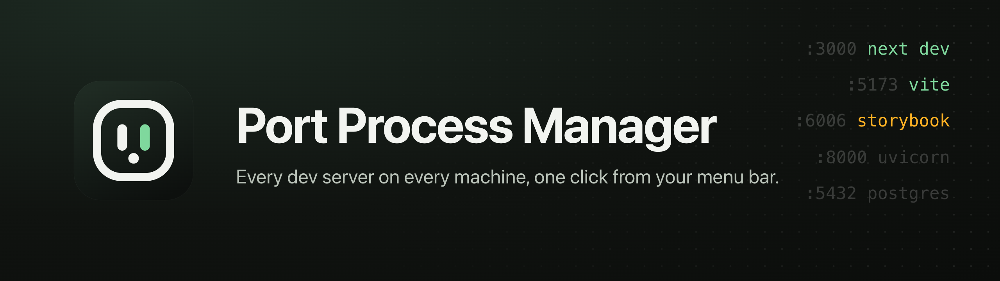
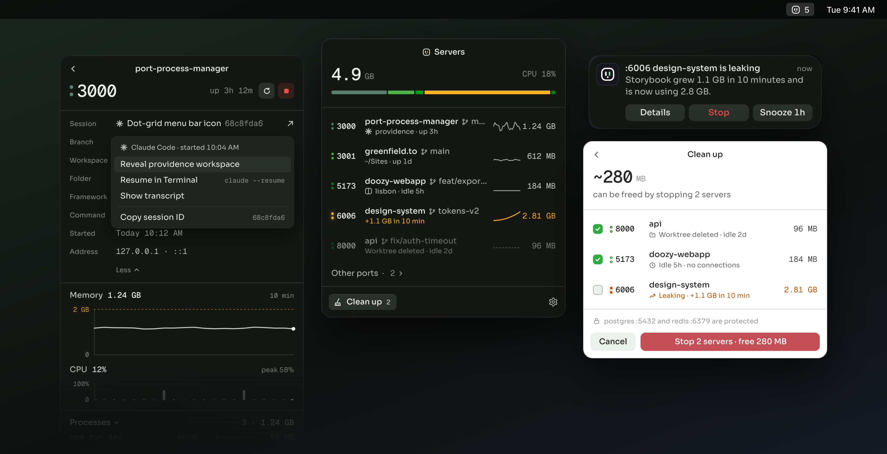
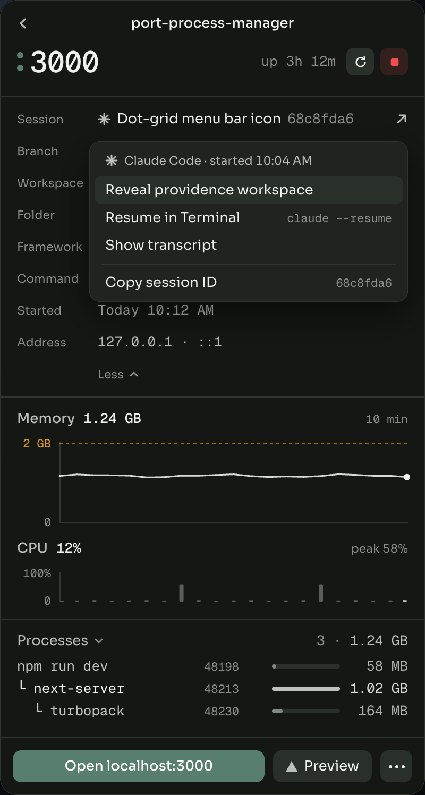
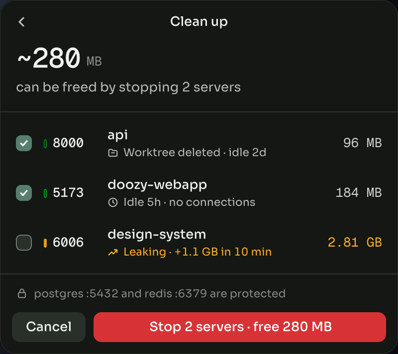
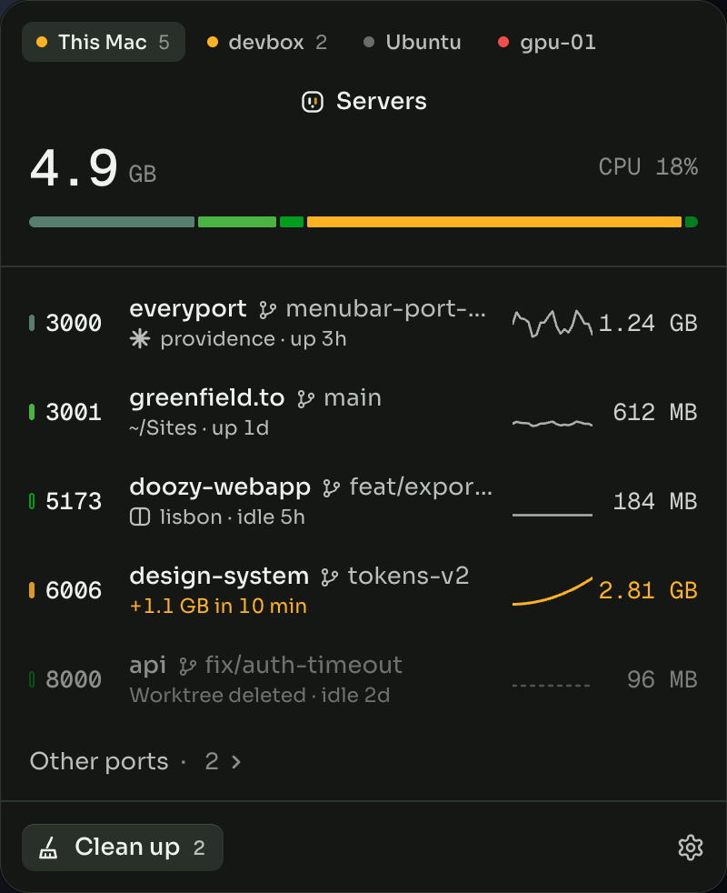
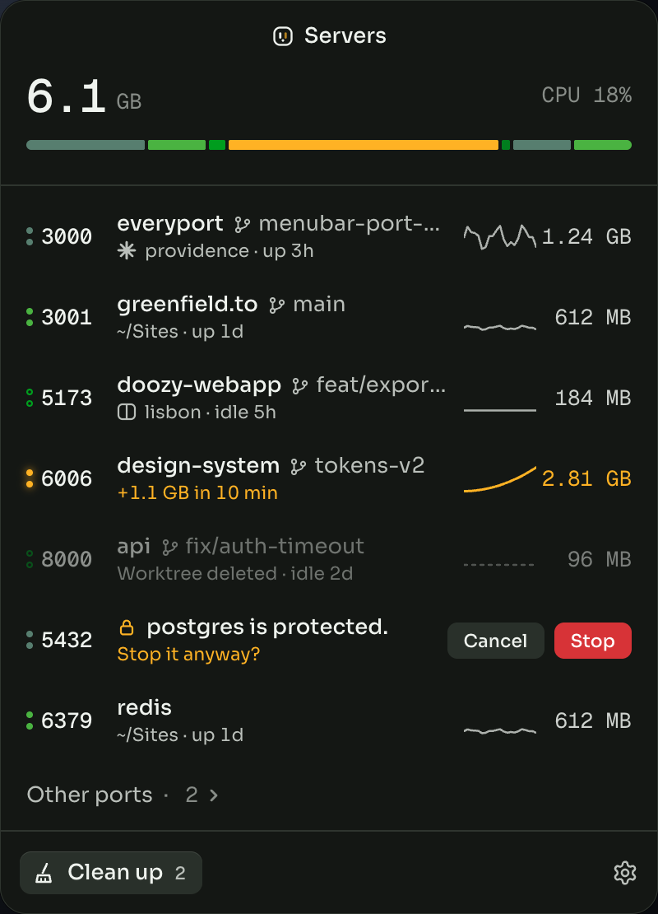
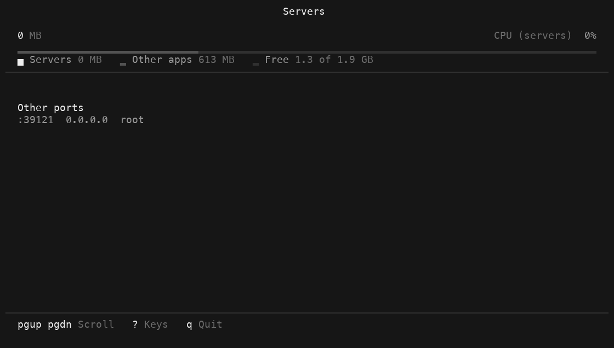

<p align="center">
  
</p>

<p align="center">
  <strong>See every dev server on your machine, or on any box you can reach, from your menu bar.</strong><br>
  <em>What it is, which branch it's on, which agent started it, and what it costs you.</em>
</p>

<div align="center">



[](https://github.com/greenfield-inc/port-process-manager/actions/workflows/ci.yml)
[](./LICENSE)
[](#install)
[](https://github.com/greenfield-inc/port-process-manager/releases/latest)
[](https://www.npmjs.com/package/port-process-manager)
[](https://crates.io/crates/port-process-manager)
[](https://pypi.org/project/port-process-manager/)
[](https://tauri.app)

<br />

**Quick install**

<sub>Desktop app and CLI: macOS, Linux</sub><br />
<pre><code>curl -fsSL https://greenfield-inc.github.io/port-process-manager/install.sh | sh</code></pre>

<sub>Desktop app and CLI: Windows (PowerShell)</sub><br />
<pre><code>irm https://greenfield-inc.github.io/port-process-manager/install.ps1 | iex</code></pre>

<sub>Other ways</sub><br />
<a href="https://github.com/greenfield-inc/port-process-manager/releases/latest">Download from Releases</a> · <code>brew install --cask greenfield-inc/tap/port-process-manager</code> · <code>winget install Greenfield.PortProcessManager</code>

<sub>CLI only: servers, VMs, containers</sub><br />
<pre><code>curl -fsSL https://github.com/greenfield-inc/port-process-manager/releases/latest/download/install.sh | sh</code></pre>

[Website](https://greenfield-inc.github.io/port-process-manager/) · [Features](#features) · [Install](#install) · [Quick start](#quick-start) · [Remote machines](#remote-machines) · [CLI](#cli) · [Docs](#documentation)

</div>

Port Process Manager (`ppm`) finds every local server listening on a port. It shows what the server is, which branch it's on, which coding agent started it, and how much memory and CPU it uses. Stop the ones you forgot about in one click.

It runs on macOS, Windows and Linux. It also watches remote machines over SSH, Docker, Kubernetes, WSL, or any command that can run a program there.

Free and open source. No account. No telemetry.

## Features

**See what's running**
- Every listening dev server with its port, project, git branch or worktree, framework and uptime
- Memory and CPU for the whole process tree behind each port, with a 10-minute history chart
- A total at the top: memory used by your servers, other apps, and what's free

**Keep your machine fast**
- Spike alerts when a server's memory crosses your threshold or keeps climbing
- Clean up: servers whose worktree was deleted, or that are idle, long-running or leaking memory
- Auto-kill for those servers, set to ask first or act on its own
- Stop or restart any server. Clean up and auto-kill skip protected processes, such as databases, and Stop and Restart ask before touching them. You can edit the protected list in **Settings → Clean up**.

**Jump to the work**
- Open `localhost:<port>` in your browser, or the Vercel preview for the same branch
- See the Claude Code or Codex session that started a server, and resume it in your terminal (on this computer and in WSL)
- See the [Conductor](https://conductor.build) workspace, [Pane](https://runpane.com) worktree or git worktree each server runs in. Pane is our workspace app for coding agents.

**Watch any machine**
- On Windows, every WSL distro shows up on its own, with the real Linux process behind each port
- Add machines from `~/.ssh/config`, your Pane remote hosts, or by hand
- Connect over `ssh`, `docker exec`, `kubectl exec`, `wsl`, or any command you choose
- The app offers to install `ppm` on a machine the first time you connect
- Opening a remote server's URL forwards its port to your machine (except for `ppm serve` machines)

**Feels native**
- Opens instantly from the menu bar, the tray, or a global shortcut
- Floats over full-screen apps without stealing focus, with the system's blur behind it on macOS and Windows
- Follows light and dark mode, with 40 color themes

**Works in your terminal too**
- `ppm` opens the same server list as a terminal UI
- `ppm list --json` and `ppm watch --jsonl` feed scripts and other tools

## Screenshots

| | |
|---|---|
|  |  |
| **Server detail.** Memory and CPU history, the process tree, and the session that started it. | **Clean up.** Deleted worktrees, idle and leaking servers. Protected databases are never touched. |
|  |  |
| **Any machine.** Switch between this Mac, a devbox over SSH, a WSL distro and more. | **Safe by default.** Stopping a protected server asks first. |

<p align="center">
  <br>
  <sub>The same list in your terminal: run <code>ppm</code>.</sub>
</p>

## Install

### Desktop app

Install the app and the `ppm` CLI with one command. It checks both against the release's SHA-256 checksums, then opens the app. The app opens without a Gatekeeper or SmartScreen prompt.

```bash
curl -fsSL https://greenfield-inc.github.io/port-process-manager/install.sh | sh
```

On Windows, in PowerShell:

```powershell
irm https://greenfield-inc.github.io/port-process-manager/install.ps1 | iex
```

On macOS the app goes into `/Applications`, or `~/Applications` if that isn't writable. On Linux it's an AppImage in `~/.local/share/port-process-manager` with a menu entry. On Windows it installs for your user, with no admin prompt. Linux on arm64 gets the CLI only, since there is no arm64 desktop build yet.

Options: `--cli` installs only the CLI, `--no-open` skips opening the app, and `--deb` installs the `.deb` with apt on Debian and Ubuntu. Pass them after `sh -s --`:

```bash
curl -fsSL https://greenfield-inc.github.io/port-process-manager/install.sh | sh -s -- --cli
```

On Windows the options are `-Cli` and `-NoOpen`:

```powershell
& ([scriptblock]::Create((irm https://greenfield-inc.github.io/port-process-manager/install.ps1))) -Cli
```

Or install it another way:

| Platform | Install |
|---|---|
| macOS 13+ | `brew install --cask greenfield-inc/tap/port-process-manager`, or the `.dmg` from [Releases](https://github.com/greenfield-inc/port-process-manager/releases/latest) |
| Windows 10/11 | `winget install Greenfield.PortProcessManager`, or the `.msi` from [Releases](https://github.com/greenfield-inc/port-process-manager/releases/latest) |
| Linux (x86_64) | `.deb`, `.rpm` or `.AppImage` from [Releases](https://github.com/greenfield-inc/port-process-manager/releases/latest) |

macOS builds are signed and notarized, and Windows builds are signed. On GNOME, the tray icon needs the [AppIndicator extension](https://extensions.gnome.org/extension/615/appindicator-support/).

### CLI only

Use the CLI on servers, VMs and containers, or if you prefer the terminal. It's one self-contained binary, `ppm`, for macOS, Windows and Linux (x86_64 and arm64). Pick one of these:

```bash
curl -fsSL https://github.com/greenfield-inc/port-process-manager/releases/latest/download/install.sh | sh
brew install greenfield-inc/tap/ppm
npx port-process-manager          # or: npm i -g port-process-manager
uvx port-process-manager          # or: pipx install port-process-manager
cargo install port-process-manager
```

On Windows, use PowerShell instead of the install script:

```powershell
irm https://github.com/greenfield-inc/port-process-manager/releases/latest/download/install.ps1 | iex
```

The install scripts and the npm and PyPI packages download the release binary for your platform and check its SHA-256 checksum. `cargo install` builds it from source.

## Quick start

1. Open Port Process Manager. On macOS, its menu bar icon shows how many servers are running.
2. Click the icon to see your servers. On many Linux desktops, the click opens a menu: pick **Open Port Process Manager**. Click a server for its details, charts and process tree.
3. Click **Clean up** to stop the servers you no longer need.

Press <kbd>⌥</kbd> <kbd>⌘</kbd> <kbd>P</kbd> (<kbd>Ctrl</kbd> <kbd>Alt</kbd> <kbd>P</kbd> on Windows and Linux) to open it from anywhere. Change the shortcut in **Settings → General**.

With the CLI only, run `ppm`. See [Getting started](docs/getting-started.md) for more.

## Clean up and auto-kill

**Clean up** suggests stopping servers whose folder or worktree was deleted, or that are idle, long-running or leaking memory. Set the limits in **Settings → Clean up**.

Auto-kill acts on servers as they start to qualify. Pick one mode in **Settings → Clean up → When servers qualify**:

- **Off** (default): they wait under Clean up.
- **Ask**: a notification asks before stopping each one.
- **Stop them**: the app stops them for you.

Auto-kill runs only in the desktop app, for this computer. `ppm watch`, the terminal UI and `ppm stdio` never turn it on by themselves. It skips protected servers, and leaves leaking ones under Clean up for you to decide. See [Settings and clean up](docs/settings.md).

## Remote machines

On Windows, each installed WSL distro is added for you. Servers running inside WSL show under their distro with their Linux process tree, and open at `localhost` as usual.

To add another machine, open **Settings → Machines**. Hosts from `~/.ssh/config` and your Pane remote hosts are listed under **Found on this computer**. Add one, and its servers appear in the app next to your local ones.

A machine is any command that runs a program on it:

| Connection | Command |
|---|---|
| SSH | `ssh devbox` |
| Docker | `docker exec -i my-container` |
| Kubernetes | `kubectl exec -i my-pod --` |
| WSL | `wsl -d Ubuntu --` |
| Anything else | your own command prefix |

The first time you connect, the app checks the machine's OS and CPU and asks to install the matching `ppm` binary in `~/.local/bin` (`%LOCALAPPDATA%\ppm` on Windows). It copies the binary through the same connection, verifies its checksum, and updates that copy when the app updates. On read-only machines, or to install it yourself, use any command from [CLI only](#cli-only).

From the terminal:

```bash
ppm remote add devbox -- ssh devbox
ppm remote list                   # saved and discovered machines, and the ppm on each
ppm --on devbox                   # terminal UI for devbox; Tab switches machines
ppm --on devbox list --json
ppm --on devbox open 5173         # forwards the port and opens it here
ppm remote rm devbox
```

`ppm --on <machine>` works with `list`, `watch`, `stop`, `restart`, `open`, `clean` and the terminal UI. A machine can be a saved one or any host `ppm remote list` discovers. The first time, ppm asks before installing itself there. Pass `--yes` to install without asking, as in scripts. `open` forwards the port through ssh or kubectl. For other connections, such as Docker, ppm runs `ppm connect` on the machine to relay it. The forward stays open until you press Ctrl-C.

See [Remote machines](docs/remote-machines.md) for more.

### Connect through Tailscale or a proxy

When you can't run a command on the machine, or want to reach it from a web page, run `ppm serve` there:

```bash
tailscale serve --bg http://127.0.0.1:7767
ppm serve --url https://devbox.tail1234.ts.net   # listens on 127.0.0.1:7767 and prints a connection code
```

`ppm serve` only listens on loopback, so it's reachable only through a tunnel or proxy you set up, and every request needs the token in the connection code. `--url` puts the address clients use into the code. Keep `ppm serve` running, for example in `tmux` or as a service.

Paste the code into **Settings → Machines → Add a machine**, or add it from the terminal with the code `ppm serve` printed: `ppm remote add devbox --code ppm://…`.

Web pages can't read its responses unless you allow their origin, as in `ppm serve --allow-origin https://dash.example.com`. See [docs/protocol.md](docs/protocol.md#browsers).

## CLI

```text
ppm                        Terminal UI with your servers
ppm list [--json]          List servers once
ppm watch --jsonl          Print a snapshot on every change
ppm stop <port>            Stop the server on a port (--protected if it's protected, --force to kill)
ppm restart <port>         Stop it, then rerun its command in the folder it started from (--protected if it's protected)
ppm open <port>            Open the server in your browser, forwarding its port with --on
ppm clean [--yes]          Stop the servers Clean up suggests
ppm stdio                  Speak the ppm protocol on stdin and stdout
ppm serve                  Speak the ppm protocol over HTTP on loopback
ppm remote add|list|rm     Manage remote machines
ppm --on <machine> ...     Run the command on another machine
ppm doctor                 Check permissions and platform support
```

Every command and option is in the [CLI reference](docs/cli.md).

## Permissions and privacy

`ppm` needs no special permissions or admin rights. It shows full details for processes your user owns. Ports owned by other users or the system show with less:

- **Linux:** the port and its owner. Linux shows which process holds the port only to root, so run `sudo ppm` to see it.
- **Windows:** the port, its owner and the process name. Without admin rights, the owner can be missing.
- **macOS:** the port, its owner and the process name. A new one can take up to 10 seconds to appear.

Everything stays on your machine. The app goes online only to look up Vercel previews, through the GitHub CLI (`gh`) and only if you turn previews on, and to download `ppm` from GitHub Releases when you install it on another machine. Settings live in your OS config folder (`~/Library/Application Support`, `%APPDATA%` or `~/.config`, under `port-process-manager`).

## Build on ppm

`ppm` speaks one JSON protocol, over stdin and stdout (`ppm stdio`) or over HTTP with server-sent events (`ppm serve`). Anything that can run a command or open a URL can show your servers: an editor extension, a status bar, a dashboard, or a workspace app like [Pane](https://runpane.com). See [docs/protocol.md](docs/protocol.md).

```bash
ppm watch --jsonl | jq '.servers[] | {port, project: .project.name, memory}'
```

## Build from source

You need Rust (stable), Node.js 20+ and pnpm.

```bash
git clone https://github.com/greenfield-inc/port-process-manager
cd port-process-manager
pnpm install
pnpm dev                                    # run the desktop app
cargo run -p port-process-manager -- list   # run the CLI
```

See [AGENTS.md](AGENTS.md) for the repo layout and checks.

## Documentation

- [Website](https://greenfield-inc.github.io/port-process-manager/): try the popover and the terminal UI in your browser
- [Getting started](docs/getting-started.md)
- [Remote machines](docs/remote-machines.md): SSH, Docker, Kubernetes, WSL, `ppm serve` and Tailscale
- [Settings and clean up](docs/settings.md)
- [CLI reference](docs/cli.md)
- [Troubleshooting](docs/troubleshooting.md): `ppm doctor`, the Linux tray and blank windows
- [The ppm protocol](docs/protocol.md)

For coding agents, [llms.txt](llms.txt) links every page.

## Credits

Port Process Manager began as a cross-platform port of [WhatThePort](https://github.com/tomjohndesign/what-the-port), a macOS app by Tomjohn Design released under the MIT license. It's built by [Greenfield](https://greenfield.to), the team behind Pane.

## License

[MIT](LICENSE)
