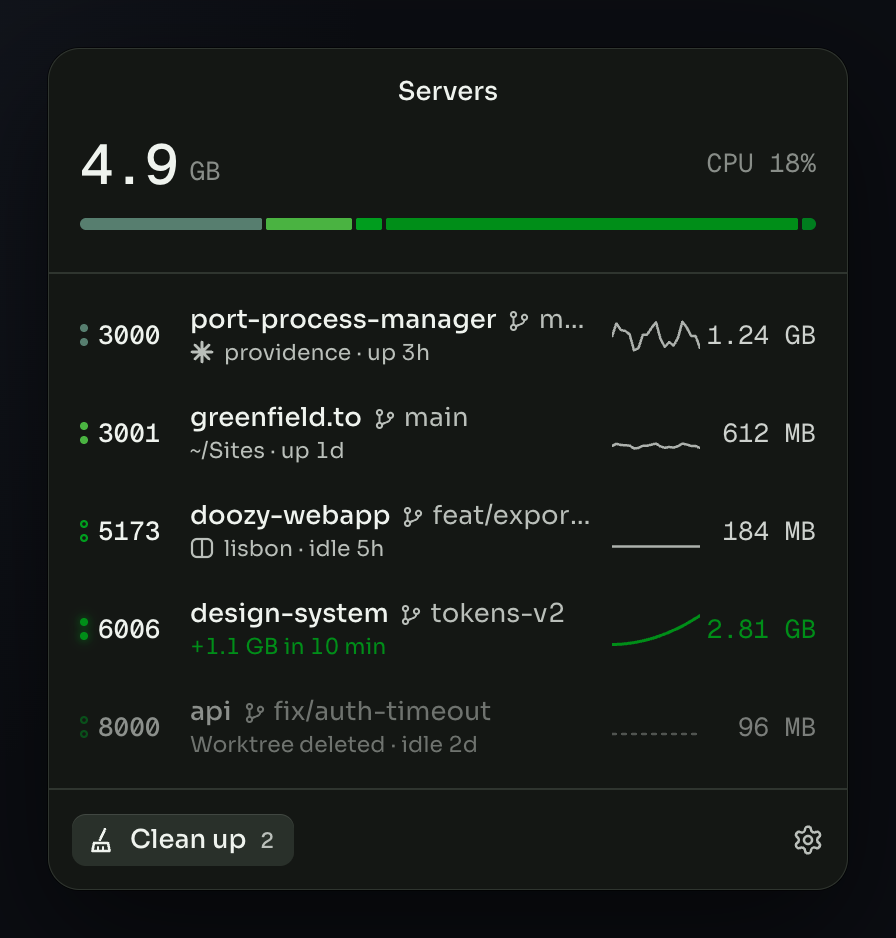

# Port Process Manager

See every dev server running on your machine, or on any box you can reach, from your menu bar.

Port Process Manager (`ppm`) finds every local server listening on a port. It shows what the server is, which branch it's on, which coding agent started it, and how much memory and CPU it uses. Stop the ones you forgot about in one click.

It runs on macOS, Windows and Linux. It also watches remote machines over SSH, Docker, Kubernetes, WSL, or any command that can run a program there.

Free and open source. No account. No telemetry.



## Features

**See what's running**
- Every listening dev server with its port, project, git branch or worktree, framework and uptime
- Memory and CPU for the whole process tree behind each port, with a 10-minute history chart
- A total at the top: memory used by your servers, other apps, and what's free

**Keep your machine fast**
- Spike alerts when a server's memory crosses your threshold or keeps climbing
- Clean up: servers whose worktree was deleted, or that are idle, long-running or leaking memory
- Auto-kill for those servers, set to ask first or act on its own
- Stop or restart any server. Clean up and auto-kill skip protected processes, such as databases. You can edit the protected list in **Settings → Clean up**.

**Jump to the work**
- Open `localhost:<port>` in your browser, or the Vercel preview for the same branch
- See the Claude Code or Codex session that started a server, and resume it in your terminal
- Groups servers by [Conductor](https://conductor.build) workspace, [Pane](https://runpane.com) worktree or git worktree

**Watch any machine**
- On Windows, every WSL distro shows up on its own, with the real Linux process behind each port
- Add machines from `~/.ssh/config`, your Pane remote hosts, or by hand
- Connect over `ssh`, `docker exec`, `kubectl exec`, `wsl`, or any command you choose
- The app offers to install `ppm` on a machine the first time you connect
- Opening a remote server's URL forwards its port to your machine

**Feels native**
- Opens instantly from the menu bar, the tray, or a global shortcut
- Floats over full-screen apps without stealing focus, with the system's blur behind it
- Follows light and dark mode, with 40 color themes
- Idles under 60 MB of memory

**Works in your terminal too**
- `ppm` opens the same server list as a terminal UI
- `ppm list --json` and `ppm watch --jsonl` feed scripts and other tools

## Install

### Desktop app

| Platform | Install |
|---|---|
| macOS 13+ | `brew install --cask greenfield-inc/tap/port-process-manager`, or the `.dmg` from [Releases](https://github.com/greenfield-inc/port-process-manager/releases/latest) |
| Windows 10/11 | `winget install Greenfield.PortProcessManager`, or the `.msi` from [Releases](https://github.com/greenfield-inc/port-process-manager/releases/latest) |
| Linux | `.deb`, `.rpm` or `.AppImage` from [Releases](https://github.com/greenfield-inc/port-process-manager/releases/latest) |

macOS builds are signed and notarized, and Windows builds are signed. On GNOME, the tray icon needs the [AppIndicator extension](https://extensions.gnome.org/extension/615/appindicator-support/).

### CLI only

Use the CLI on servers, VMs and containers, or if you prefer the terminal. It's one self-contained binary, `ppm`, for macOS, Windows and Linux (x86_64 and arm64).

```bash
curl -fsSL https://github.com/greenfield-inc/port-process-manager/releases/latest/download/install.sh | sh
brew install greenfield-inc/tap/ppm
npx port-process-manager          # or: npm i -g port-process-manager
uvx port-process-manager          # or: pipx install port-process-manager
cargo install port-process-manager
```

The install script and the npm and PyPI packages download the release binary for your platform and check its SHA-256 checksum. `cargo install` builds it from source.

## Quick start

1. Open Port Process Manager. Its icon shows how many servers are running.
2. Click the icon to see your servers. Click a server for its details, charts and process tree.
3. Click **Clean up** to stop the servers you no longer need.

Press <kbd>⌥</kbd> <kbd>⌘</kbd> <kbd>P</kbd> (<kbd>Ctrl</kbd> <kbd>Alt</kbd> <kbd>P</kbd> on Windows and Linux) to open it from anywhere. Change the shortcut in **Settings → General**.

## Remote machines

On Windows, each installed WSL distro is added for you. Servers running inside WSL show under their distro with their Linux process tree, and open at `localhost` as usual.

To add another machine, open **Settings → Machines**. Hosts from `~/.ssh/config` and your Pane remote hosts are already listed. Pick one, and its servers appear in the menu next to your local ones.

A machine is any command that runs a program on it:

| Connection | Command |
|---|---|
| SSH | `ssh devbox` |
| Docker | `docker exec -i my-container` |
| Kubernetes | `kubectl exec -i my-pod --` |
| WSL | `wsl -d Ubuntu --` |
| Anything else | your own command prefix |

The first time you connect, the app checks the machine's OS and CPU and asks to install the matching `ppm` binary in `~/.local/bin`. It copies the binary through the same connection, verifies its checksum, and updates it when the app updates. On read-only machines, or to install it yourself, use any command from [CLI only](#cli-only).

From the terminal:

```bash
ppm remote add devbox -- ssh devbox
ppm --on devbox                   # terminal UI for devbox
ppm --on devbox list --json
```

### Connect through Tailscale or a proxy

When a command connection won't work, for example from a browser, run `ppm serve` on the machine:

```bash
tailscale serve --bg http://127.0.0.1:7767
ppm serve --url https://devbox.tail1234.ts.net   # listens on 127.0.0.1:7767 and prints a connection code
```

`ppm serve` only listens on loopback, so it's reachable only through a tunnel or proxy you set up, and every request needs the token in the connection code. `--url` puts the address clients use into the code. Paste the code into **Settings → Machines → Add by code**.

Web pages can't read its responses unless you allow their origin, as in `ppm serve --allow-origin https://dash.example.com`. See [docs/protocol.md](docs/protocol.md#browsers).

## CLI

```text
ppm                        Terminal UI with your servers
ppm list [--json]          List servers once
ppm watch --jsonl          Print a snapshot on every change
ppm stop <port>            Stop the server on a port (--force to kill)
ppm restart <port>         Stop it, then rerun its command in the folder it started from
ppm open <port>            Open http://localhost:<port>
ppm clean [--yes]          Stop the servers Clean up suggests
ppm stdio                  Speak the ppm protocol on stdin and stdout
ppm serve                  Speak the ppm protocol over HTTP on loopback
ppm remote add|list|rm     Manage remote machines
ppm --on <machine> ...     Run any command against a remote machine
ppm doctor                 Check permissions and platform support
```

## Permissions and privacy

`ppm` needs no special permissions or admin rights. It sees every listening port, and full details for processes your user owns. For processes owned by other users or the system, it shows the port and process name only.

Everything stays on your machine. The app goes online only to look up Vercel previews, through the GitHub CLI (`gh`) and only if you turn previews on. Settings live in your OS config folder (`~/Library/Application Support`, `%APPDATA%` or `~/.config`, under `port-process-manager`).

## Build on ppm

`ppm` speaks one JSON protocol, over stdin and stdout (`ppm stdio`) or over HTTP with server-sent events (`ppm serve`). Anything that can run a command or open a URL can show your servers: an editor extension, a status bar, a dashboard, or a workspace app like [Pane](https://runpane.com). See [docs/protocol.md](docs/protocol.md).

```bash
ppm watch --jsonl | jq '.servers[] | {port, project: .project.name, memory}'
```

## Build from source

You need Rust (stable), Node.js 20+ and pnpm.

```bash
git clone https://github.com/greenfield-inc/port-process-manager
cd port-process-manager
pnpm install
pnpm dev                                    # run the desktop app
cargo run -p port-process-manager -- list   # run the CLI
```

See [AGENTS.md](AGENTS.md) for the repo layout and checks.

## Credits

Port Process Manager began as a cross-platform port of [WhatThePort](https://github.com/tomjohndesign/what-the-port), a macOS app by Tomjohn Design released under the MIT license. It's built by [Greenfield](https://greenfield.to), the team behind Pane.

## License

[MIT](LICENSE)
